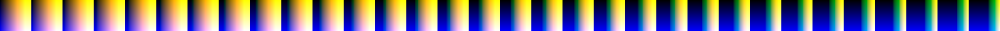

CBLUTGen
========

This is a tool for simulating and/or correcting for the main three types of
colour blindness, protanopia, deuteranopia, and tritanopia. The first two of
these, known collectively as red-green colour blindness, are the most common,
and are X-chromosome linked, meaning they predominantly affect males.
Tritanopia, or blue-yellow colour blindness, is much is rarer, but age-related
lens yellowing can be seen as a mild form of it.

The tool can either process one-off source images, or be used to generate lookup
tables, for use in real-time applications, e.g., as a post-process in a shader.
Alternately the functions in CBLut.* can be incorporated directly into your own
code.

Correction
----------

The default form of colour-blindness correction supplied operates in LMS space,
and primarily shifts hues in affected areas. For instance, common
colour-blindness advice for protanopia and deuteranopia is to avoid the classic
red/green colour combination, and prefer magenta/green, and this approach
effectively transforms the former into the latter.

Also implemented is the commonly-used approach of Fidaner et al., which
redistributes error in the affected channel to other channels in RGB space. This
is typically referred to as "Daltonisation", although that is really a more
general term for any form of colour correction. It has the effect of brightening
and desaturating the image in affected areas.

In my tests the hue-based correction does a better job than Fidaner, however,
I'd suggest trying both to see which best suits your particular scene type, as
results are dependent on the distribution of source colours.

RGB LUTs
--------

The LUTs are in 32x32x32 RGB cube format, represented as 32x1024 2D images, as
this is generally a good compromise between fidelity and size. (This can be
changed by modifying kLUTBits in the source.) If you're only interested in the
LUTs, pregenerated versions can be found in the [luts](luts) directory.

__Identity__

__Simulate: P/D/T__

__Correct: P/D/T__

__Daltonise: P/D/T__

The tool can also be used to apply arbitrary LUTs to source images. For
instance, by generating an identity LUT, then applying arbitrary image
processing operations to that LUT (say in Photoshop), you'll get a LUT that can
be used to apply the same operations to any image with a single texture lookup.

Extras
------

The strength of colour blindness can be specified via "-m float", to reflect the
common case of anomalous vision, namely, one cone type having reduced
sensitivity, rather than being completely missing. In the case of the custom
correction, a mixed strategy that initially brightens the affected channel and
then switches to hue shifts is used. This is a balance between strengthening the
affected channel, which works well for small losses, and the hue shift, which
works best when the loss is large enough that compensating directly would lead
to out-of-band luminance values.

There are numerous test images for red-green colour blindness, most famously the
Ishigara coloured-dot diagrams. A selection of these are provided in the
[tests](tests) directory. Blue-yellow colour-blind test images are on the other
hand much rarer, so cblutgen implements a strategy for converting the former
into the latter -- see the -r option. Note that this is not as simple as just
swapping channels, as doing that affects the image white point.

Finally the tool supplies two colour blind-savvy false colour (luminance -> rgb)
maps, via the -c option. It also supports three more standard maps, and applying
any 256-wide png as a map. See cblutgen -h for more info, and
[ColourMaps.h](ColourMaps.h) for references.

     __Viridis__ (decent)

     __Cividis__ (optimised further, a bit plainer)

Building
--------

To build and run the tool, use

    c++ --std=c++11 CBLuts.cpp ColourMaps.cpp CBLutGen.cpp -o cblutgen

Or, include these files in your favourite IDE, build, and run.

To generate simulated and corrected versions of the supplied [test
images](tests/README.md), along with markdown-style results files, run the supplied
"generate" script. (Currently unix-style OSes only.) The results can be found in
the 'out' directory.
