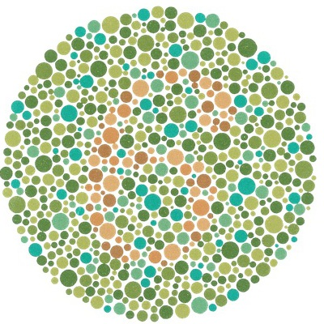
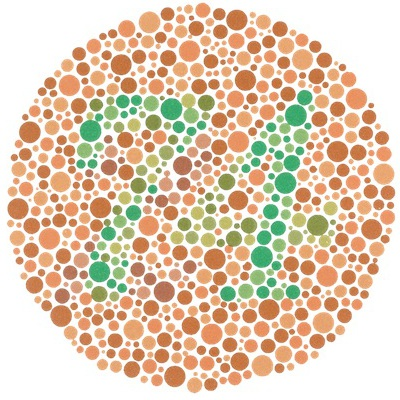

Colour-Blindness Test Images
----------------------------

### Selected [Ishihara](https://en.wikipedia.org/wiki/Ishihara_test) plates

   6. Colour-blind see nothing

   74. Red/green colour-blind see 21

   97. Red/green colour-blind see nothing

   45. Colour-blind see nothing

   42. Red colour-blind (protanopia) see 2, Green colour-blind (deuteranopia) see 4

These plates assume 6500K illumination (warm).

### Test Images For Transformations

   __Fall Trees__

       __Flower__
